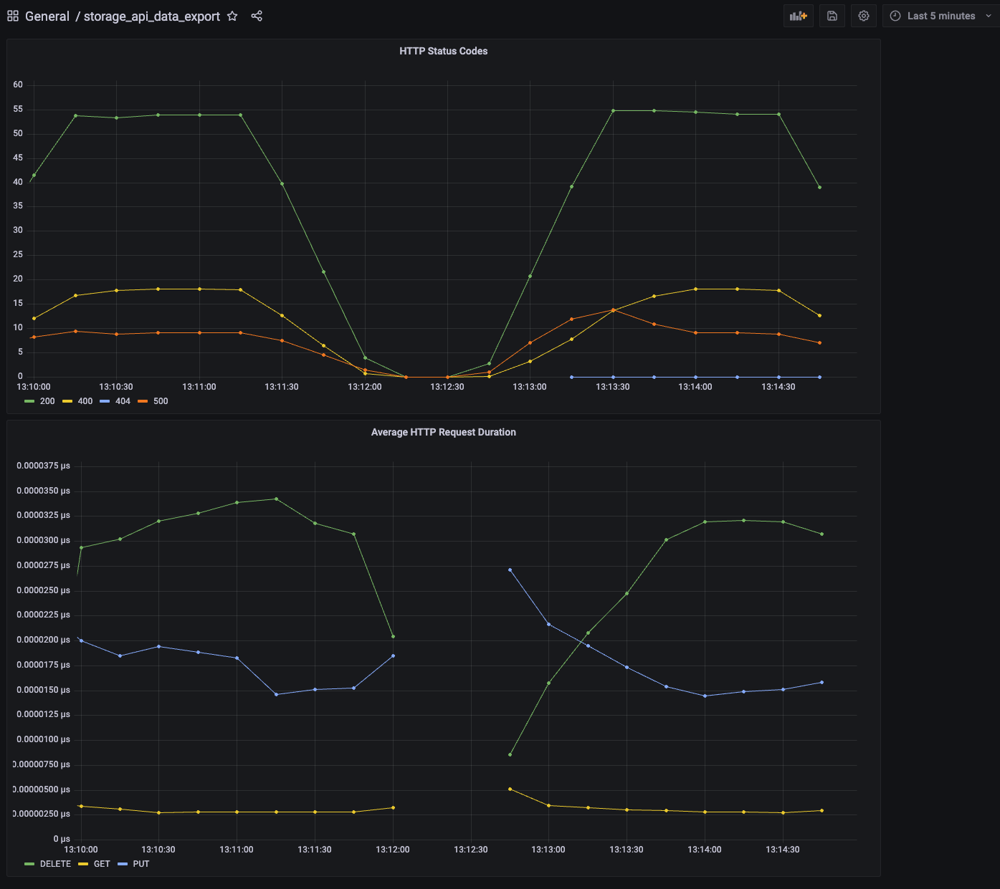

# SRE Instrumentation Challenge

- To run the application, run 'docker compose up' from the 'sre-implementation-challenge' folder. This is where the dockerfile and docker-compose.yml are located
- Generate some test traffic by opening a new terminal and running ./scripts/generate_traffic.sh
- To deploy onto kubernetes, navigate to the ./deploy/kubernetes folder and run 'kubectl apply -f .'

- Python code for the storage_api has been modified to include prometheus instrumentation as described. The relevant endpoints to access in the deployment are:

    - localhost:5000/metrics **Storage API Metrics endpoint**
    - localhost:9090/targets **Prometheus scrape target**
    - localhost:3000 **Grafana login**

### Step 1: Implementation

- Add the Prometheus metrics endpoint to the Storage API 
    - **Done.** '__init__.py' line 13-16
- Expose HTTP request duration in seconds by path, method and status code
    - **Done.**  bucket.py line 20 - 43. It is in the form of a decorator that wraps the route functions to avoid duplication wihin each route.
- Create a Dockerfile for the Storage API. The Prometheus Server expects it to run on `http://storage_api:5000`.
    - **Done.** 
- Add the newly dockerized Storage API to our docker-compose setup
    - **Done.** 

### Step 2: Visualization

Prometheus Datasource and Grafana dashboard is automatically provisioned when application is deployed. It looks like this:

4. Try to figure out why you see HTTP 500 errors for some endpoints

    -  It generates a 500 on successful DELETE method. It should be 200. I left as is for illustrative purposes.

### Step 3: Deployment

All Kubernetes Yaml files in ./deploy/kubernetes.

## Evaluation criteria

What we're looking for:

- We expect the resulting Storage API to be equally simple. Even if you don't know Python, the Flask and Prometheus documentation should provide enough guidance
- The Dockerfile and your changes to docker-compose.yml are sensible and concise. You can talk about the pros and cons of your setup in relation to convenience vs security.
- It works reliably. `docker-compose up` and your documentation should be all that is required to review your solution
- Scratch features when necessary, time is short!
- Document your approach, your decisions, and your general notes
